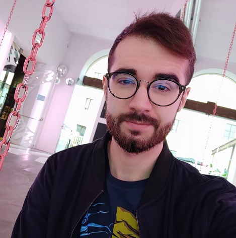
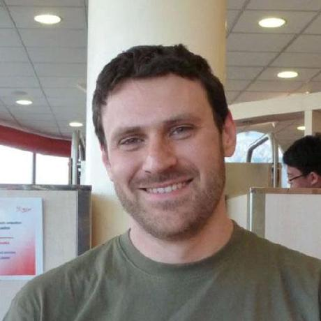
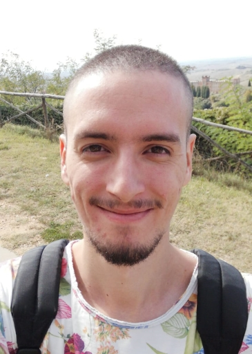
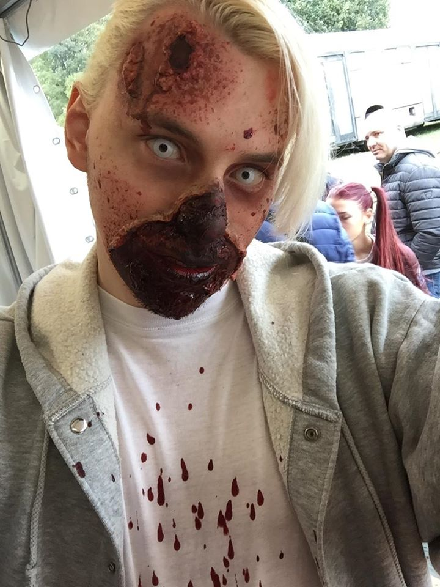
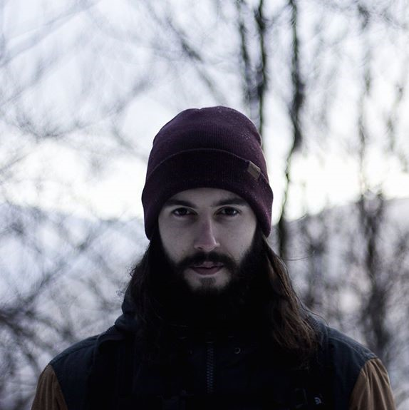
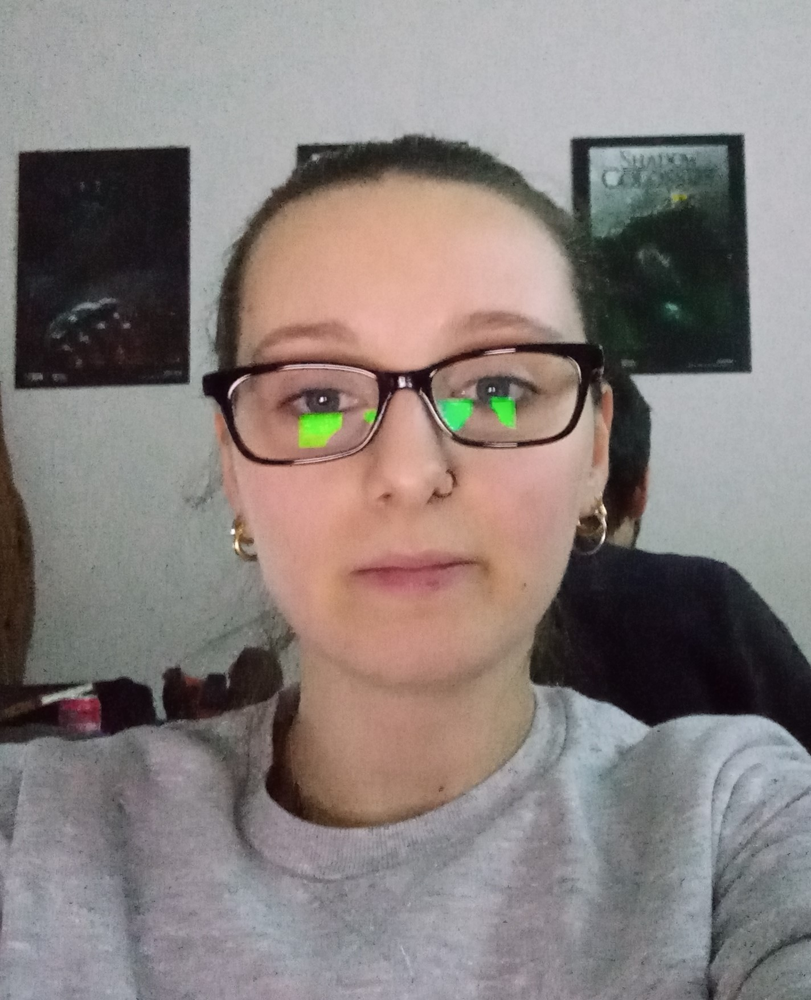
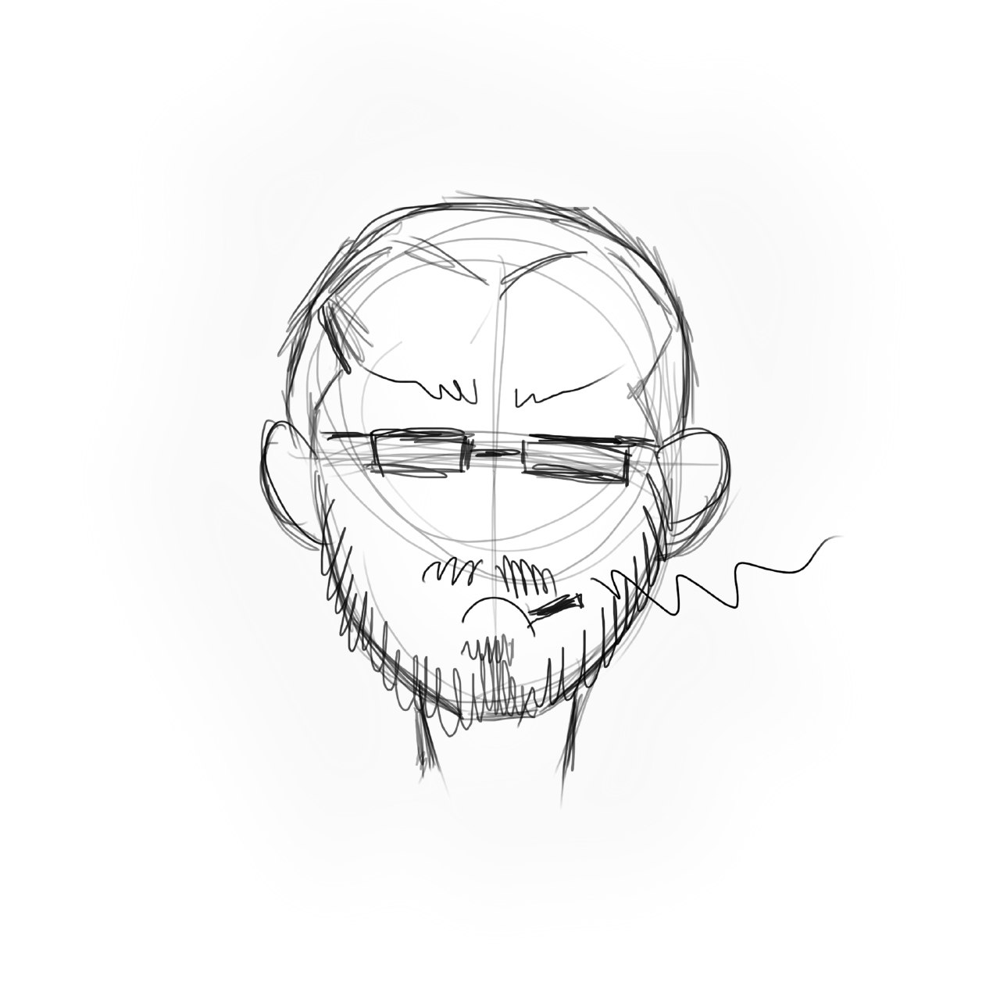
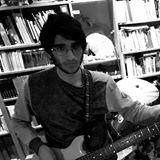
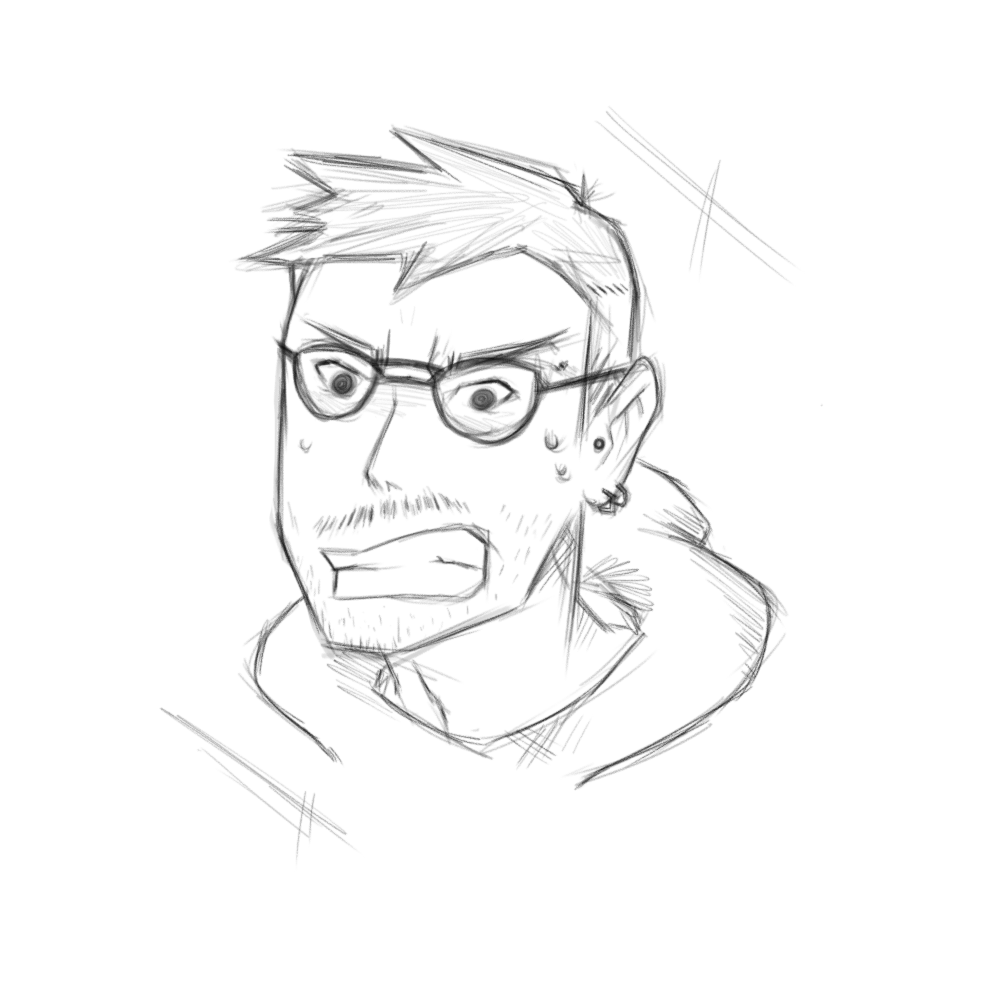
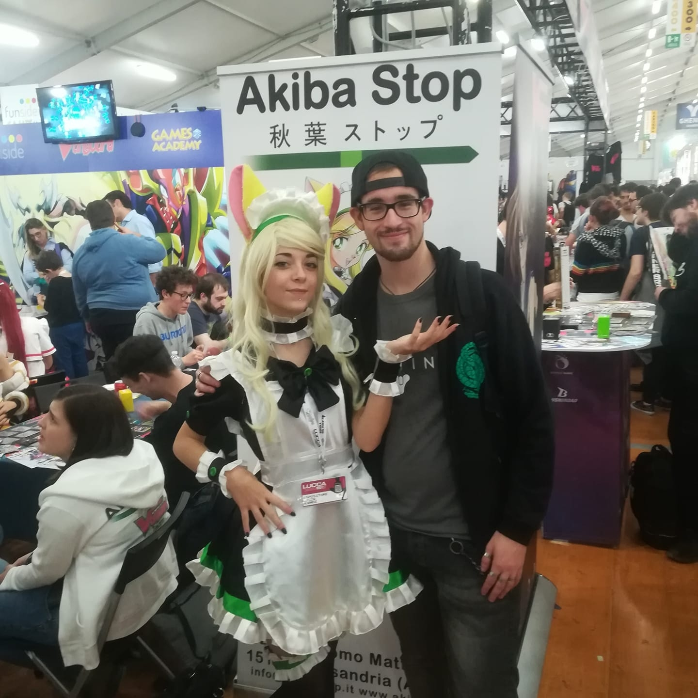

# Studenti anno 3 - 2019/2020

NB: che le immagini siano tutte JPG di dimensione massima 512x512 

## Programming
|   | Nome | Corso | Team | Url |
|---|---|---|---|---|
| | Nicolò Renzoni | Game Programming | Clumsy Team | [github.com/KlausRenzo](https://github.com/KlausRenzo) [klausrenzo.github.io](https://klausrenzo.github.io)
| | Gianni Vallerini | Game Programming | Team Firefang | [GitHub](https://github.com/gianni173)[GitHub.io](https://gianni173.github.io/)
| | Andrea Cianfanelli | Game Programming | Team Minecrab | [github.com/cinfa78](http://github.com/cinfa78) [cinfa78.github.io](http://cinfa78.github.io) [instagram.com/cinfa78](http://www.instagram.com/cinfa78/)  

## Game Design
|   | Nome | Corso | Team | Url |
|---|---|---|---|---|
| | Eugenio Roverato | Student | Team Focaccina | [github.com/EugenioRoverato](https://github.com/EugenioRoverato) [EugenioRoverato_Website](https://eugenioroverato.github.io/eurov.github.io/)|

## Concept Art
|   | Nome | Corso | Team | Url |
|---|---|---|---|---|
| | Lorenzo Romani | Concept Art | N | [github.com/Akuma96](https://github.com/Akuma96)|
| | Samuele Bandini | Concept Art | Team Firefang | [github.com/SamueleBandini](https://github.com/SamueleBandini) [Artstation](https://www.artstation.com/samuelebandini)|
| | Emma Profita | Concept Art | Clumsy Team | [github.com/Gracileprofita](https://github.com/Gracileprofita)|
| | Nicola Gagliardi | Student | Clumsy Team | [github.com/NicolaGagliardi](https://github.com/NicolaGagliardi)|
| | Tommaso Mechini | Student | Team 0 | [github.com/Mecons](https://github.com/Mecons)|
| | Enrico Fida | Student | team Focaccina| [github.com/Enri96](https://github.com/Enri96)
| | Andrea Morigi | Student | team Focaccina| [github.com/maelstrom-darkzapphire](https://github.com/maelstrom-darkzapphire)
| | Marco Nannini | Student | team Clumsy| [github.com/NannoGamer](https://github.com/NannoGamer)

## 3D Art
|   | Nome | Corso | Team | Url |
|---|---|---|---|---|
