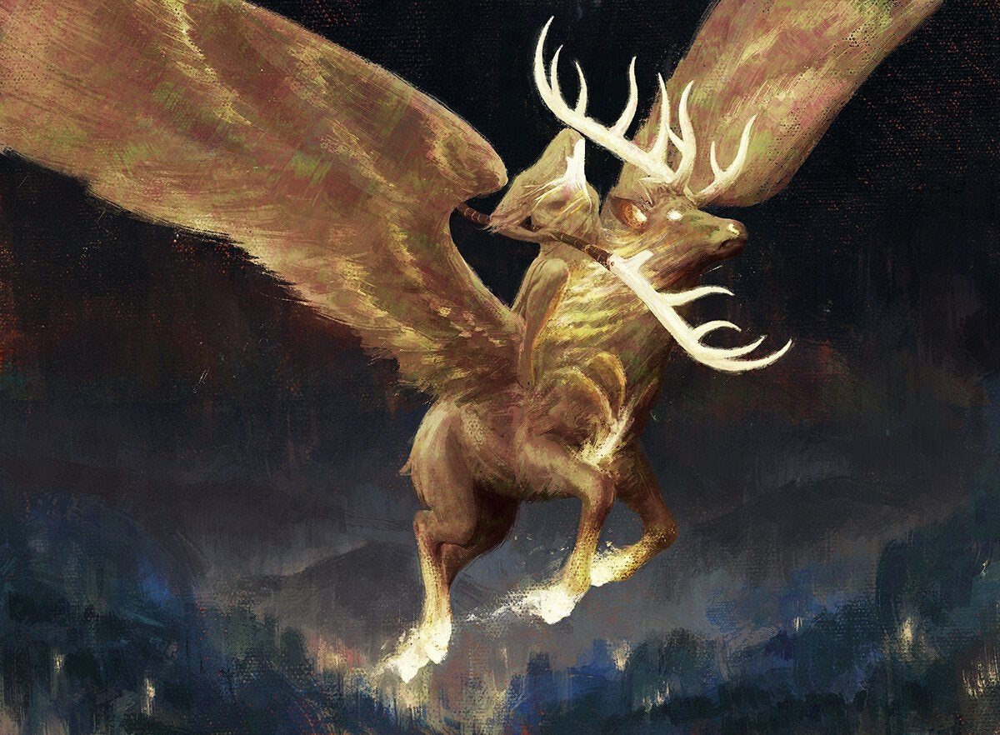

# Studenti anno 3 - 2019/2020

NB: che le immagini siano tutte JPG di dimensione massima 512x512 

|   | Nome | Corso | Team | Url |
|---|---|---|---|---|
| | Nicolò Renzoni | Game Programming | Clumsy Team | [github.com/KlausRenzo](https://github.com/KlausRenzo) [klausrenzo.github.io](https://klausrenzo.github.io)
| | Francesco Lanzo | Teacher | N | [github.com/Franz0](https://github.com/Franz0) [https://twitter.com/_frnzo](A twitter guy)
| | Lorenzo Romani | Concept Artist | N | [github.com/Akuma96](https://github.com/Akuma96)|
| | Samuele Bandini | Concept Art | Team Firefang | [github.com/SamueleBandini](https://github.com/SamueleBandini) [Artstation](https://www.artstation.com/samuelebandini)|
| | Emma Profita | Concept Art | Clumsy Team | [github.com/Gracileprofita](https://github.com/Gracileprofita)|
| | Nicola Gagliardi | Student | Clumsy Team | [github.com/NicolaGagliardi](https://github.com/NicolaGagliardi)|
| | Tommaso Mechini | Student | Team 0 | [github.com/Mecons](https://github.com/Mecons)|
| | Enrico Fida | Student | team Focaccina| [github.com/Enri96](https://github.com/Enri96)
| | Andrea Morigi | Student | team Focaccina| [github.com/maelstrom-darkzapphire](https://github.com/maelstrom-darkzapphire)
| | Marco Nannini | Student | team Clumsy| [github.com/NannoGamer](https://github.com/NannoGamer)
